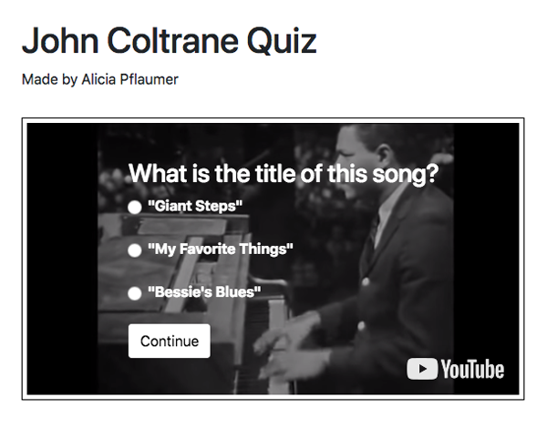

## Video player with quiz questions project

Instructions for viewing project:

1. Clone or Download this repository
2. In your local directory for the project, `cd video-quiz`
3. Run `npm install http-server -g` to install http-server
4. To start server to view on localhost run `http-server . -o`, app will open on `localhost:8080`
5. To stop server, ctrl + c

# To do:

• [ DONE ] Pause video at 30 seconds, show question
    • [ ] unpause video after answer submitted
• [ ] Currently only one question is hard-coded in `index.html`, instead need to load questions from the JSON file (already created)
• [ ] Show score at end
